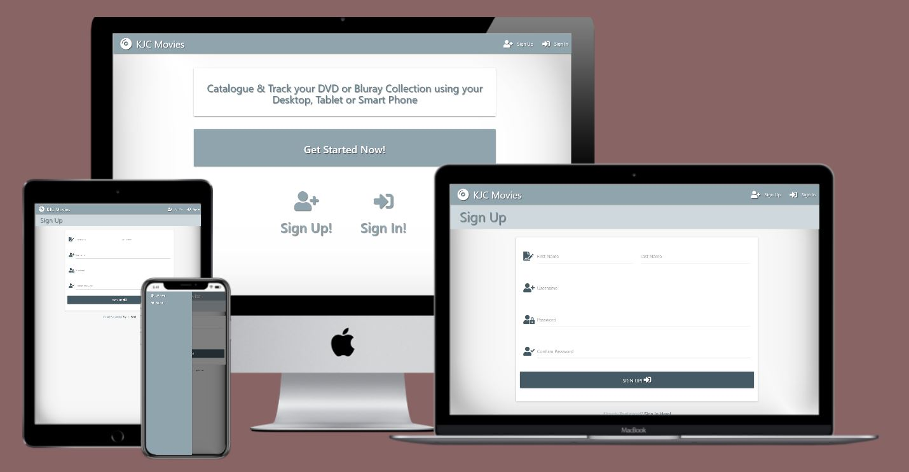

--------
<h1 align="left">Ken Cormican | Milestone Project Three </h1>


<h2 align="left">Data Centric Development</h2>

--------

## Demo

[View the live project here.](http://kjc-movie-catalogue-milestone3.herokuapp.com/)

--------
#### To facilate is of marking I've created a dummy admin/admin account that is already populated with several titles.
--------

## Purpose

In late 1995 Samsung announced it would start mass-producing DVDs.  The format which initial focussed primarily on music videos was formally launched in Japan in November 1996.  However, Movie and home entertainment distributors quickly adopted the DVD format to replace the ubiquitous VHS tape. Over the next two decades the DVD format and subsequently Bluray dics became the primary means of consuming videos by the public across the globe. Consumers embraced the DVD because of its high quality video and sound, superior data lifespan, and the fact that it could also provide interactive functionalty.

The format has become somewhat obselete over the past three years, in large part due to the genesis of online streaming services such as Netflix, Hulu and Amazon Prime, however, many consumers have amassed vast archives of DVDs & Blurays in the inetrvening two decades.

The purpose of this website it to provide these same end users with the ability to create a media library tracking their DBVD and/or Bluray collection/s.  In developing this website I intend on creating a fully responsive user experience that will provide consumers with the ability to perform the complete set of CRUD (Create, Read, Update & Delete) operations on their catalogues.  

To enhance UX the website will also allow registered users to consume the Internet Movie Database or IMDb API, retrieving title information and auto populating the consumer entries. In addition to the ability to customize their collections and individual title information the end user will also be be able to store additional personal information relating to their titles, including purchase date, price, watched dtate and a peronal user rating.

--------

<h2 align="center"></h2> 


## The Project Brief
--------
The brief was to create a full-stack site that allows consumers of the site to manage a common dataset.  
In creating the site, the developer should expose the learnings from the HTML, CSS, JavaScript, Python, Flask, MongoDB Modules. 

1. Design, develop and implement a backend for a web application using Python and a micro-framework
2. Implement custom HTML and CSS code to create a responsive full-stack application consisting of one or more HTML pages with relevant responses to user actions and a set of data manipulation functions
3. Build a non-relational database-backed Flask web application that allows users to store and manipulate data records about a particular domain.
4. Demonstrate competence in modelling and managing non-relational data effectively
5. Create functionality for users to create, locate, display, edit and delete records
6. Test the application through the development, implementation and deployment stages
7.  Deploy a final version of the full-stack application code to a cloud-based hosting platform (e.g. Heroku) and test to ensure it matches the development version 
8. Demonstrate and document the development process through a version control system 


--------


## User Experience (UX)

### Requirements

Use Materialize and Flask Frameworks, in conjunction with MongoDB and the IMDB API too render information about end user libraries to the Front End.
The Website should be responsive allowing end users to perform the full set of CRUD operations at both a collection and titles level.
The end users should be able to view their catalogue in its entirety or filter stored titles based on collection, genre, release date, director or search criteria.
In addition, the above the end user should be able select individual titles to display and edit more detailed information. 
Site structure and purpose should be clear from the outset providing the end user with an intuitive learning experience.
The website should be fully responsive and clearly display good UX design for small, medium and large breakpoints.


--------

### User stories:

Ask Num | Scenario                                                                                                                                       			    |
:--     | :----------------------------------------------------------------------------------------------------------------------------------------------------------   |
1       | As a First Time Visitor, I want to easily understand the main purpose of the site?                                                                            |
2       | As a First Time Visitor, I want to be able to easily navigate the site and create libraries or collections based on my own criteria                           |
3       | As a First Time Visitor, I would like to be able to view, modify and delete a collection as required                                                          |
4       | As a First Time Visitor, I would like the ability to create a new title entry and add it to a collection.                                                     |
5       | As a First Time Visitor, I would like the ability to edit title details including their association with a collection                                         |
6       | As a First Time Visitor, I would like the ability to delete a title from the catalogue                                                                        |
1       | As a Returning Visitor, I would like to be able to display statistics associated with my catalogue including the number of collections and titles 			|
2       | As a Returning Visitor, I would like the website to provide a facility to display all titles or collections within my catalogue                   			|
3       | As a Returning Visitor, I would like the website to provide a facility to filter titles based on certain criteria such as Genre, Release year or Collection	|
1       | As a Frequent User, I would like to be able to search for a specific title across the entire catalogue							                            |
2       | As a Frequent User, I would like to be able to use online tools to search for information associated with a title									            |
3		| Finally, as a Frequent User, I would like to be able to use the search results to auto populate fields with the database for a given title                    |

### Design

#### Colour Scheme
-   I felt that a basic blue-grey and white webpage design was more aesthetically pleasing.
-   Colour is to be introduced through the poster images/urls associated with the titles themselves
-	Re the base template I've decided to use subtle different in shades of the Materialize blue-grey colour scheme to separate Nav from Header, Card and Flash Message components.

#### Typography
-   The Segoe UI family of fonts are the Materialize defaults with Roboto and Sans Serif acting as the fallback fonts.
-   I've decided to use both Font Awesome and Materialize icons to highlight functionality and make the site more intuitive.
-	Font-awesome icons are preferred over Materialize icons because they provide a greater degree of variation and flexibility.
-	For example, the disc icon used in the main nav as the Brand Logo.
-	Where possible I've used the Materialize Header elements to keep font sizes consistent across the various templates.
-	I've used Materialize helper classes to align text within the various html containers.
-	I've used CSS to customise materialize defaults further. These include but are not limited to various degrees of text-shadowing, font-sizes and text decoration
-	Finally, I've used a combination of CSS transforms, python and Jinga methods to alter text capitalisation at various points within the project.

#### Imagery
-   I've used Materialize card-image components in conjunction with the title image urls to provide a central point of focus for the website. I've also used standard materialize card elements, and icon styled with the sites blue-grey theme to provide secondary points of focus.
-	For the initial site callout and the Brand Logo I've used an enlarged Font Awesome compact disc icon.
-	The main the integrity of the site and for consistency of UX I've created a default poster, using a combination of various movie related imagery, to populate the materialize card-image elements in the event an end user fails to select an image URL from the web during the title creation process.

#### Responsive Elements
-   I've used the materialize fixed nav and side-nav classes to provide a more user-friendly experience at different window sizes.
-	I've used a collapsible, with side nav for mobile and tablet devices and fixed side-nav for larger devices.
-   The plan was to limit the top nav to Logo, search element and reg/user login details and extend available functionality via side nav.
-	Sign Up/In/Out/User Profile will be hidden on fixed side nav but made available for mobile collapsible side nav. 
-	li and ul elements were also targeted at different window sizes using the Materialize show and hide helper classes.
-	Jinga if statements, targeting user session, in conjunction with media queries, targeting the large breakpoint, were used to remove the fixed side nav for unregistered users callout page, the registration and the login pages.
-	I've also used Jinga in conjunction with jquery to target the logo-wrapper class on small devices.  This was resulting in the brand header image aligning left as opposed to centre for small and medium devices and needed to be removed at those breakpoints, however, it was required for improved UX a large window sized.
-	I used the materialize grid system to target form and card components at the various window sizes.
-	Several form button elements and input elements were altered to render more cleanly between large and small window sizes.
-	Card Images were also rendered differently for the titles pages at different breakpoints with 4x card images being displayed at large and xlarge 3x at medium and 1x at small breakpoints.
-	I also used the materialize horizontal card type to render the card image and description differently on mobile devices.

#### Interactive Elements
-   The Matrialize framework was used to provides a multitude of interactive features for this site.
-	These included but were not limited hoverable helper classes, tooltips, character counters, modals, form validation, select dropdown menus and date pickers.
-   The Materialize card-image activator class was used to create animation/transition between the image iteslef and the plot description viewed in a card envelope.
-	I also used the flash library within the flask microframework to provide additional feedback to the user following interaction with the site.
-	The nav bar was customised heavily to render as intended and for the collapsible, top and side-navs to produce to required interactivity.
-	In addition to the above, search result feedback and form update templates were created, and supported on to backend using python to provide the end user with progress indicators during the IMDd search process

#### Authentication
-	The Werkzeug library was used with Flask and a ‘users’ collection in MongoDB, to create registration and authentication processes.
-	The two main helpers used for this were are "generate_password_hash", and "check_password_hash".
-	This combined with html pattern validation and a littles python password verification provided some simple security functionality.
-	This also facilitated the creation of user specific catalogues, IMHO a prerequisite to delivering on the project terms of reference.


### Wireframes

--------
####  Light Theme

- Mobile Balsamiq Mockups: Small Window Sizes - [View](assets/wireframes/lightTheme/mobileOnlyWireframes_lightTheme.JPG)

- Tablet Balsamiq Mockups: Medium Window Sizes - [View](assets/wireframes/lightTheme/tabletOnlyWireframes_lightTheme.JPG)

- Desktop Balsamiq Mockups: Large Window Sizes - [View](assets/wireframes/lightTheme/desktopOnlyWireframes_lightTheme.JPG)


--------
####  Dark Theme

- Mobile Balsamiq Mockups: Small Window Sizes - [View](assets/wireframes/darkTheme/mobileOnlyWireframes_darkTheme.JPG)

- Tablet Balsamiq Mockups: Medium Window Sizes - [View](assets/wireframes/darkTheme/tabletOnlyWireframes_darkTheme.JPG)

- Desktop Balsamiq Mockups: Large Window Sizes - [View](assets/wireframes/darkTheme/desktopOnlyWireframes_darkTheme.JPG)

--------

## Features

### Authentication

To ensure a viable production site I felt it was important to protect users from accidentally modifying or erasing one another’s entries.  To do so I introduced a simple registration and authentication process using the Werkzeug library described in our tutorials.  Once activated users can be isolated from one another and provided with personalised feedback messages.

- Click to View the [registration & login pages](assets/images/registration_and_login_views.jpg) for the major breakpoints

- Click to View the personalised user profile pages for [Small](assets/images/profile_mobile_view.jpg), [Medium](assets/images/profile_tablet_view.jpg) & [Large](assets/images/profile_desktop_view.jpg) Window Sizes

### Home Page Cards

The Homepage uses Responsive Materialize card-images with content activators to provide the end user with a visually appealing overview of their entire catalogue.  In addition to the title name this materialize feature also provides the user with a quick and easy way to access a plot summary via the activator class.

-   Click to View the Homepage for [Small](assets/images/home_mobile_view.jpg), [Medium](assets/images/home_tablet_view.jpg) & [Large](assets/images/home_desktop_view.jpg) Window Sizes

### Search and Filter

The mobile collapse and fixed side-nav anchors provide the user with a simple and aesthetically pleasing way to quickly filter the catalogue in many different ways.

- Click to View the navbars for [Small](assets/images/home_mobile_view_navbar.jpg), [Medium](assets/images/home_tablet_view_navbar.jpg) & [Large](
assets/images/home_desktop_view.jpg) Window Sizes


### Add Title

This template provides the user with the ability to add a new title to the catalogue via a web based form.  The page provides client-side form validation and immediate feedback to the user via character counters, tool tips and flash messaging. The form also allows the user to set a personal rating value to the title via an animated star rating utility. In addition to the above this template provides an IMDB search facility via a separate search button.

- Click to View the Add Title Page for [Small](assets/images/add_title_mobile_view.jpg), [Medium](assets/images/add_title_tablet_view.jpg) & [Large](assets/images/add_title_desktop_view.jpg) Window Sizes

- Click to View sample IMDb Search results for [Small](assets/images/imdb_search_mobile_view.jpg), [Medium](assets/images/imdb_search_tablet_view.jpg) & [Large](assets/images/imdb_search_desktop_view.jpg) Window Sizes

### View Title detail 

This template provides the user with detailed information by querying the mongoDB document associated with the title.  Apart from name, release year, genre, collection, cast, director, duration and plot details this view also provides stored personal details such as user rating, purchase date, watched state and purchase price.

- Click to View the Title Details View for [Small](assets/images/detail_mobile_view.jpg), [Medium](assets/images/detail_tablet_view.jpg) & [Large](
assets/images/detail_desktop_view.jpg) Window Sizes

### Edit Title

The edit template and view augment the add functionality by providing the and user to query a pre-exiting record on the database and populate the form with the results of the query. Again the imdb search functionality is available to dynamically populate the form with the results of an external query.

- Click to View the edit page template for [Small](assets/images/edit_title_mobile_view.jpg), [Medium](assets/images/edit_title_tablet_view.jpg) & [Large](assets/images/edit_title_desktop_view.jpg) Window Sizes

### Manage Collections

In addition to the CRUD functionality provided for the individual titles, this solution also provides the end user a full set of CRUD functionality for the Collections the titles are to be stored within.  

- Click to View the Manage Collections tempates for [Small](assets/images/manage_collections_mobile_view.jpg), [Medium](assets/images/manage_collections_tablet_view.jpg) & [Large](assets/images/manage_collections_desktop_view.jpg) Window Sizes

### Delete

Delete functionality has been provided for both teh collection and title entries.  Both processes have been wired up to modals and flash messages to provide the end user with control and feedback.


### Movie Catalogue Database Overview

#### MongoDB libraries collection

Key             | Value                      | Type                                                                                                   	 		       |
:--             | :--------------------------| :--------------------------------------------------------------------------------------------------------------------   |
library_id      | .id                        | ObjectId                                                                                                                |
created_by      | user                       | string                                                                                                                  |
library_name    | libarary                   | string                                                                                                                  |

#### titles collection
Key             | Value                      | Type                                                                                                   	 		       |
:--             | :--------------------------| :--------------------------------------------------------------------------------------------------------------------   |
title_id        | .id                        | ObjectId                                                                                                                |
library_name    | library_name               | string                                                                                                                  |
title_name      | title_name                 | string                                                                                                                  |
release_year    | release_year               | string                                                                                                                  |
description     | description                | string                                                                                                                  |
genre           | genre                      | string                                                                                                                  |
director        | director                   | string                                                                                                                  |
cast            | cast                       | string                                                                                                                  |
duration        | duration                   | string                                                                                                                  |
image_url       | image_url                  | string                                                                                                                  |
is_watched      | is_watched                 | string                                                                                                                  |
is_bluray       | is_bluray                  | string                                                                                                                  |
my_rating       | my_rating                  | string                                                                                                                  |
purchase_price  | purchase_price             | string                                                                                                                  |purchase_date   | purchase_date              | string                                                                                                                  |
created_by      | user                       | string                                                                                                                  |

#### users collection
Key             | Value                      | Type                                                                                                   	 		       |
:--             | :--------------------------| :--------------------------------------------------------------------------------------------------------------------   |
user_id         | .id                        | Objectid                                                                                                                |
first_name      | first_name                 | string                                                                                                                  |
last_name       | last_name                  | string                                                                                                                  |
username        | username                   | string                                                                                                                  |
password        | password                   | string                                                                                                                  |


## Technologies Used

### Languages Used

-   [HTML5](https://en.wikipedia.org/wiki/HTML5)
-   [CSS3](https://en.wikipedia.org/wiki/Cascading_Style_Sheets) 
-   [JAVACRIPT](https://en.wikipedia.org/wiki/JavaScript) 
-   [PYTHON](https://en.wikipedia.org/wiki/Python_(programming_language)) 

### Frameworks, Libraries & Programs Used

1. [Font Awesome:](https://fontawesome.com/)
    - Font Awesome was used for the footer nav icon for aesthetic and UX purposes.
1. [Materialize 1.0.0:](https://materializecss.com/)
    - Masterialize was used to assist with the responsiveness and styling of the website.
1. [jQuery 3.5.1:](https://jquery.com/)
    - The project uses JQuery to simplify DOM manipulation and to enhance the Materialize framework. 
1. [Flask 1.1.2:](https://flask.palletsprojects.com/en/1.1.x/)
	- Microframework used to enhance Python capabilities
1. [Werkzeug 1.0.1:](https://werkzeug.palletsprojects.com/en/1.0.x/)
	- Library used to manage and enhance security and authentication functionality
1. [Flask-PyMongo 2.3.0:](https://pypi.org/project/Flask-PyMongo/)
    - MongoDB support for Flask applications.
1. [dnspython 2.0.0:](https://pypi.org/project/dnspython/)
	- Libraries used to interface with MongoDB
1. [imdbPY 2020.9.25:](https://imdbpy.github.io/)
    - imdbPy is a Python library used to process and manage the interactions between the site and IMDb API before rendering information to the front end.
1. [IMDb API] (https://developer.imdb.com/)
	- Used by imdbPY to retrieve information about screen titles
1. [MongoDB:](https://www.mongodb.com/)
	- Cloud based  general purpose, document-oriented, distributed Database
1. [GitPod:](https://www.gitpod.io/)
	- Used as the IDE to develop the project
1. [Git](https://git-scm.com/)
    - Git was used for version control by utilizing the Gitpod terminal to commit to Git and Push to GitHub.
1. [GitHub:](https://github.com/)
    - GitHub is used to store the projects code after being pushed from Git.
1. [Microsoft Paint:](https://en.wikipedia.org/wiki/Microsoft_Paint)
    - Microsoft Paint was used to create the responsive image for the ReadMe.md and to capture the balsamiq & wireframe images in a generic format.
1. [Balsamiq:](https://balsamiq.com/)
    - Balsamiq was used to create the [wireframes](assets/wireframes/lightTheme/desktopOnlyWireframes_lightTheme.JPG) during the design process.

--------
##  Testing 

### Testing during the Development Process
*	Main & Side Navs:	
	-	A significant amount of customization was required to ensure the main and side navs operated in the way I intended.
	-	Several configs were applied, and Multiple iterations of testing were completed to ensure the top and sidenav functioned as planned. In the main, I utilised Chrome DevTools to isolate the elements and features I required.  In particular they were extremely useful when customising unwanted Materialize default behaviour, as was the case with dropping the sidenav below the top nave and altering the search input element.
	-	The materialise search input defaults also had to be modified to operate in the top nav and without materialize icons.

*	Flash messages:
	-	Identified unwanted defaults for flash messages. Altered default margins and padding to facilitate design theme. Also identified grid overflow on flash after user profile anchor added to top menu.  resolved by adjusting navbar grid layout.

*	Sign Up Page/Functionality:
	-	Cycled through multiple iterations of correct and incorrect register behaviour to verify flash responses and that MongoDB was being checked and updated correctly.

*	Default Template:
	-	Materialize valign-wrapper helper class did not vertically align callout card. An additional custom callout-wrapper and vertical-center style had to be added to resolve issue.

*	All Titles Template:
	-	Top & side nav disconnected on scroll for titles template. With a single row of images on desktop view the default materialize card action increased the card size marginally and temporarily during transition which resulted in a mirage type affect due to fluctuation of scroll area.  This would introduce a negative UX so I resolved it by setting a max-height limit to the column. Also used Materialize fixed helper class to prevent disconnect.
	-	Also found that Materialize default card-image height changed relative to size of poster image it contained.  Tried several CSS mechanisms to limit the fluctuation but ultimately resolved the problem using the large helper class.  This fixed the size of each card relative to the window size as opposed to the image within.
	-	For the default Materialize card content display the text was overflowing at quite high viewports and resulting in the more-vert icon being pushed to the next line. To resolve this used additional materialize row, col and truncate functionality.

*	Detailed Title Template:
	-	Decided to go with icons with simple jinga if statement logic for Is watched, Is Bluray and My Rating functionality. Also added purchased date to theme. Logic included for null as well as populated entries on My Rating.

*	Base Template:
	-	Fixed side nav was displayed in all views regardless of whether user was logged in or not.  Wanted to remove for unregistered and logged out users.  To do this I moved media query from style.css into base.html styles jinga block and set conditional statement against user session for both style and entire sidenav ul element.  When this was added to ul the headercontent jinga block overflowed into sidenav.  To resolve this I encapsulate the ul in it's own wrapper div and places headercontent extend block outside div but still within header element thereby maintaining semantic html.


*	Add & Edit Templates:
	-	Encountered issue when attempting use two submit buttons in add and edit templates forms. The first submit being the form submit, the second being the imdb search button. I initially attempted to resolve using an anchor tag with an url_for() method but that failed to capture the input. Following a conversation with my mentor I then attempted to pass information between form and backend using jQuery AJAX and get.JSON method. That ultimately failed because they're not designed for the purposes of rendering an independent page. It was ultimately resolved through form itself and targeting different submit button ids.  
	
*	Star rating feedback loop:
	-	Used external code snippet based on jQuery and CSS as time saver when creating the personal star rating input for add and edit forms.
	While this worked for data submission, I had great difficulty altering the code to auto-populate with feedback from mongoDB for existing data.  Ultimately resolved by using a simpler CSS only solution.  Then used jQuery to target and update the star input values using addclass method.  

-------

### Testing User Stories from User Experience (UX) Section

#### First Time Visitor Goals
Ask Num | Scenario                                                                                                                                       			    |
:--     | :----------------------------------------------------------------------------------------------------------------------------------------------------------   |
1       |   As a First Time Visitor, I want to easily understand the main purpose of the site?                                                                          |
2       | 	As a First Time Visitor, I want to be able to easily navigate the site and create libraries or collections based on my own criteria                         |
3       | 	As a First Time Visitor, I would like to be able to view, modify and delete a collection as required                                                        |
4       | 	As a First Time Visitor, I would like the ability to create a new title entry and add it to a collection.                                                   |
5       | 	As a First Time Visitor, I would like the ability to edit title details including their association with a collection                                       |
6       | 	As a First Time Visitor, I would like the ability to delete a title from the catalogue                                                                      |


*  To facilitate the First Time Visitor Goals:
    - Upon entering the site, users are greeted with clean and easily readable Banner, Navigation and Callout messages highlighting the sites intent.[1]
    - Beneath that they are presented with one of two options, to register or to sign-in.
    - Following clean and unambiguous registration and sign-in processes, aided by form validation and tooltips, the user is presented with a customer specific homepage.
    - The homepage displays all titles within a customer’s catalogue.[2]
    - Each time the page is loaded the end user is also presented with a flash message indicating how may titles they have in their catalogue.
    - For a first-time user this is zero.
    - From the homepage the user can easily navigate to any of the form submission pages required to create a title (add title) or collection (manage collections).[2]
    - If the user attempts to create a title without first creating a collection they will firstly, be rejected (by the form validation), and secondly be guided to create a collection, via to tooltips messages associated with the form.[2]
    - Upon opening the manage collections page they will be presented with a empty page and a single option, to add a collection.
    - Upon completion of the process the user is returned to the collections page where they can view the newly created collection and receive a flash feedback message indicating the task was successful[3].
    - From there they can return to manage collections page where they will be presented with the options to edit or delete the newly created collection.[3]  
    - From there the can navigate to the add title page where they will be guided through the process by a form validation, pattern recognition and a series of tooltips.[4]
    - Within the newly populated homepage they can select the title via clicking the card or the link immediately beneath the card.  This brings them to the title detail page where they can fulfil requirements [5] & [6].

#### Returning Visitor Goals
Ask Num | Scenario                                                                                                                                       			    |
:--     | :----------------------------------------------------------------------------------------------------------------------------------------------------------   |
1       | As a Returning Visitor, I would like to be able to display statistics associated with my catalogue including the number of collections and titles 			|
2       | As a Returning Visitor, I would like the website to provide a facility to display all titles or collections within my catalogue                   			|
3       | As a Returning Visitor, I would like the website to provide a facility to filter titles based on certain criteria such as Genre, Release year or Collection	|

*  To facilitate a Returning Visitor's Goals:
    - A registered customer can select the user profile link from any page within the site, where they are immediately presented with a flash message and a callout card indicating how many collections and titles they have within their catalogue.[1]
    - The homepage automatically displays all titles associated with an end user and, when selected, the collections or manage collections views display all libraries within their catalogue.[2] 
    - The Collections, Genres, Release Years and Directors anchor links on the side nav provide the end user with the ability to filter titles based on those criteria, thereby fulfilling requirement [3]


#### Frequent User Goals
Ask Num | Scenario                                                                                                                                       			    |
:--     | :----------------------------------------------------------------------------------------------------------------------------------------------------------   |
1       | As a Frequent User, I would like to be able to search for a specific title across the entire catalogue							                            |
2       | As a Frequent User, I would like to be able to use online tools to search for information associated with a title									            |
3		| Finally, as a Frequent User, I would like to be able to use the search results to auto populate fields with the database for a given title                    |

*  To facilitate the Frequent User Goals:
    - The top-nav on desktop devices and the side-nav for mobile and tablet devices provides users with the ability to perform text-based searches on the entire catalogue fulling requirement [1]
    - Both the add and edit title pages provide a facility to search the IMDb database online and automatically populate the users form, thereby fulling requirements [2] & [3].


### Further Testing.

*   The Website was tested on Google Chrome, Internet Explorer, Microsoft Edge and Firefox browsers. No major issues were identified.
*   Responsive Testing was completed using [Techsini Multi-mockup](https://techsini.com/multi-mockup/index.php)
    - The Web Page renders well at small, medium and large window sizes.
    - Click to View the Homepage for [Small](assets/images/home_mobile_view.jpg), [Medium](assets/images/home_tablet_view.jpg) & [Large](assets/images/home_desktop_view.jpg) Window Sizes
    - Click to View the Title Details View for [Small](assets/images/detail_mobile_view.jpg), [Medium](assets/images/detail_tablet_view.jpg) & [Large](
assets/images/detail_desktop_view.jpg) Window Sizes
    - Click to View the Manage Collections View for [Small](assets/images/manage_collections_mobile_view.jpg), [Medium](assets/images/manage_collections_tablet_view.jpg) & [Large](assets/images/manage_collections_desktop_view.jpg) Window Sizes

*   The ReadMe.md page was tested using the [Markdown Live Preview](https://markdownlivepreview.com/)

*   The HTML code was tested using the [W3C HTML Validator](https://validator.w3.org/#validate_by_input).
    - Mutiple errors were highlighted however the majority related to the W3C utility being unable to process jinga.

*   The HTML semantic elements were also checked against [w3schools.com Semantic definitions](https://www.w3schools.com/html/html5_semantic_elements.asp#:~:text=or%20Vice%20Versa%3F-,The%20element%20specifies%20independent%2C%20self%2Dcontained%20content,defines%20section%20in%20a%20document.)

*   The CSS code was tested using the [W3C CSS Validator](https://jigsaw.w3.org/css-validator/)
    - One warning remains. An unrecognised materialize vendor extension.

*   The JavaScript code was validated using [JSHint](https://jshint.com/)
    -   2 Warnings remain. Both are associated with external js snippet provided  during the Putting It All Together Tutorial for the materialize select issue.


--------

## Deployment

### GitHub Pages

The project was deployed to GitHub Pages using the following steps...

1. Log in to GitHub and locate the [GitHub Repository](https://github.com/kencormican/milestoneProjectThree) from the list of available repos.
2. At the top of the Repository (not top of page), locate the "Settings" Button on the menu.
3. Scroll down the Settings page until you locate the "GitHub Pages" Section.
4. Under "Source", click the dropdown called "None" and select "Master Branch".
5. The page will automatically refresh.
6. Scroll back down through the page to locate the now published site [link](https://kencormican.github.io/milestoneProjectTwo/) in the "GitHub Pages" section.
    - Note* to function correctly the main html page must be named "index.html"

### Forking the GitHub Repository

By forking the GitHub Repository we make a copy of the original repository on our GitHub account to view and/or make changes without affecting the original repository by using the following steps...

1. Log in to GitHub and locate the [GitHub Repository](https://github.com/kencormican/milestoneProjectThree)
2. At the top of the Repository (not top of page) just above the "Settings" Button on the menu, locate the "Fork" Button.
3. You should now have a copy of the original repository in your GitHub account.

### Making a Local Clone

1. Log in to GitHub and locate the [GitHub Repository](https://github.com/kencormican/milestoneProjectThree)
2. Under the repository name, click "Clone or download".
3. To clone the repository using HTTPS, under "Clone with HTTPS", copy the link.
4. Open Git Bash
5. Change the current working directory to the location where you want the cloned directory to be made.
6. Type `git clone`, and then paste the URL you copied in Step 3.

```
$ git clone https://github.com/YOUR-USERNAME/YOUR-REPOSITORY
```

7. Press Enter. Your local clone will be created.

```
$ git clone https://github.com/YOUR-USERNAME/YOUR-REPOSITORY
> Cloning into `CI-Clone`...
> remote: Counting objects: 10, done.
> remote: Compressing objects: 100% (8/8), done.
> remove: Total 10 (delta 1), reused 10 (delta 1)
> Unpacking objects: 100% (10/10), done.
```

Click [Here](https://help.github.com/en/github/creating-cloning-and-archiving-repositories/cloning-a-repository#cloning-a-repository-to-github-desktop) to retrieve pictures for some of the buttons and more detailed explanations of the above process.


--------

### If running locally on an IDE such as GitPoD

1. Install all local dependencies including Flask, PyMongo & dnspython

```
>pip3 install Flask
>pip3 install flask-pymongo
>pip3 install dnspython
```

2. Create env.py file and .gitignore .

```
>touch env.py
>touch .gitignore
```

3. Target env.py with .gitignore

```
>__pycache__/
>env.py
```

4. Store all sensitive data including mongoDB URI, passoword, dbname ip port and secret key,  as environmental variable within env.py
```
>import os
>os.environ.setdefault("IP", "0.0.0.0")
>os.environ.setdefault("PORT", "5000")
>os.environ.setdefault("SECRET_KEY", "your_secret_key_here")
>os.environ.setdefault("MONGO_URI", "mongodb+srv://<USERNAME>:<PASSWORD>@<CLUSTER>-4g3i1.mongodb.net/<DBNAMEW>?retryWrites=true&w=majority")
>os.environ.setdefault("MONGO_DBNAME", "<DBNAMEW>")
```


5. Copy the URI from the mongoDB connect option directly to the env.py file.


6. Link the app.py with the environmental variables and flask libraries.

```
>import os
>from flask import (
>    Flask, flash, render_template,
>    redirect, request, session, url_for)
>from flask_pymongo import PyMongo
>from bson.objectid import ObjectId
>if os.path.exists("env.py"):
>    import env
>
>
>app = Flask(__name__)
>
>app.config["MONGO_DBNAME"] = os.environ.get("MONGO_DBNAME")
>app.config["MONGO_URI"] = os.environ.get("MONGO_URI")
>app.secret_key = os.environ.get("SECRET_KEY")
>
>mongo = PyMongo(app)
>
>
>if __name__ == "__main__":
>    app.run(host=os.environ.get("IP"),
>            port=int(os.environ.get("PORT")),
>            debug=True)
```


7. Run app.py locally on the ide using:
```
>python3 app.py
```

### Heroku Deployment

1. Create a requirements.txt file using the terminal command pip3 freeze > requirements.txt

2.	Create a Procfile with the terminal command 
echo web: python app.py > Procfile
3.	Git add and git commit the new Procfile and requirements.txt files to GitHub.

4.	Create a new app on Heroku website by clicking “New” give it a name and assign it to you nearest region USA or Europe.

5. From the Heroku dashboard select GitHub as the Deployment method

6. Link the Heroku app to the correct GitHub repository.

7. In the Heroku dashboard for your app click on settings “Reveal Config Vars”

8. Set the following vars

|  |  |
|--|--|
| DEBUG |FALSE  |
| IP |  0.0.0.0|
| PORT |5000  |
| SECRET_KEY | your_secret |
|MONGO_URI  |  mongodb+srv://<USERNAME>:<PASSWORD>@<CLUSTER>-4g3i1.mongodb.net/<DBNAMEW>?retryWrites=true&w=majority|

9. in the “Manual Deployment” section of the page, make sure master branch is selected and then click “Deploy Branch”


## Credits

### Code

-   As part of the preparation for this project I reviewed the several systems for streaming online content to gauge how best to approach the design and planning stages. These sites included but were not limited to Netflix, NowTV, the RTE Player and Plex.

-	The Edit and Add Title Template Star Ratings CSS & HTML Code was extracted from an [External Code Snippet](http://code.iamkate.com/html-and-css/star-rating-widget/#css ) provided by Kate Rose Morley.

- 	The jquery code resolving the Materialize select issue was taken directly from the Code Institute "Materilaize Form Validation" Tutorial and source code link provided by Tim Nelson. 

-	The code and logic used to create this project was heavily influenced by the CI Practical Python and Data Centric Development Modules. In particular the "Putting it all Together" MongoDB and Flask tutorials provided by Tim Nelson and the Code Institute team.

-   [Materialize](https://materializecss.com/): Materialize Library used throughout the project mainly to make site responsive using the Materialize Grid System.

-   [w3schools.com](https://www.w3schools.com/default.asp) : For Javascript, Python, HTML, CSS & Bootstrap Tutorials


### Content

-   All content was either written by the developer or derived from open source data sets rendered to the Web page via the imdbPY library and IMDb API calls.


--------


